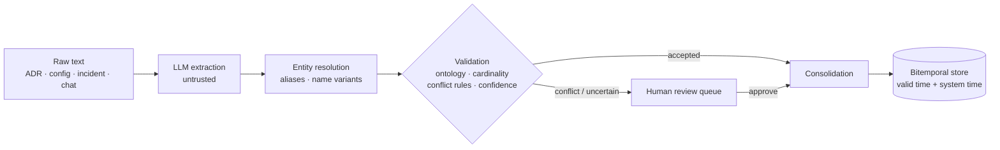

<h1 align="center">🧠 Enterprise Engineering Memory Agent</h1>

<p align="center">
  <b>A persistent memory layer for AI agents that knows what is true <i>now</i>, what was true <i>before</i>, and what to <i>distrust</i>.</b>
</p>

<p align="center">
  
  
  
  
  
  
</p>

<p align="center">
  <a href="#-why-this-exists">Why</a> ·
  <a href="#-how-it-works">How it works</a> ·
  <a href="#-quickstart">Quickstart</a> ·
  <a href="#-evaluation">Evaluation</a> ·
  <a href="#-roadmap-poc--mvp">Roadmap</a> ·
  <a href="Enterprise_Engineering_Memory_Agent_Design.md">Design doc</a>
</p>

---

## 💡 Why this exists

Engineering knowledge changes constantly. A service moves from Stripe to Razorpay, an ADR supersedes an old one, an incident report contradicts the docs, and an agent confidently repeats last quarter's answer.

**Vector RAG treats every document as equally true and equally current.** It surfaces stale or unverified text, and the LLM trusts it.

This project treats memory as **structured, time-aware, source-aware facts** instead of a pile of embeddings:

| Question an agent needs to answer | Vector RAG | This memory layer |
|---|---|---|
| *What payment provider does PaymentService use **now**?* | Often returns the outdated one | Current fact from the most authoritative source |
| *What did it use **in March**?* | No notion of time | Bitemporal "as-of" query |
| *When did it **change**?* | ❌ | Change timeline per entity |
| *A developer's Slack claim contradicts the production config* | Both retrieved, LLM guesses | Conflict detected, sent to human review, history kept |
| *The agent failed this task the same way 3 times* | ❌ | Verified lessons promoted into experience memory |

---

## ⚙️ How it works

### Write path: from raw text to trusted facts



### Read path: answering with evidence


### Source authority (high → low)

`production_config` → `architecture_repo` → `official_docs` → `incident_report` → `developer` → `agent_inference`

A lower-authority claim can **never silently overwrite** a higher-authority fact. It is stored as `conflicted` and routed to review.

### Key capabilities

- 🕰️ **Bitemporal memory:** separate *valid time* (when it was true) and *system time* (when we learned it)
- 🛡️ **Poisoning-resistant:** injected or stale low-authority claims are detected; accepted facts and history stay intact
- 🔗 **Entity resolution:** handles aliases and name variants with measured similarity thresholds
- 👤 **Human-in-the-loop:** review queue for conflicts and uncertain candidates
- 🔁 **Experience memory:** episodes → reflection → lessons verified against evidence before they are ever injected
- 🧭 **LangGraph workflows:** separate query flow and task flow

---

## 🚀 Quickstart

```bash
uv sync
cp .env.example .env            # set GOOGLE_API_KEY (Gemini). Model IDs are configurable.
uv run pytest                   # offline: uses a fake LLM/embedder, no network
uv run memory-agent demo        # Stripe -> Razorpay story with real Gemini calls
```

### CLI

```bash
uv run memory-agent ingest docs/adr-042.md --source-type architecture_repo --date 2026-09-15
uv run memory-agent ask "Which payment provider does PaymentService use now?" --show-context
uv run memory-agent timeline PaymentService
uv run memory-agent reviews                       # conflicts / uncertain candidates awaiting a human
uv run memory-agent decide rev_xxx --approve
```

---

## 📊 Evaluation

All systems use the **same LLM (Gemini 2.5 Flash, temperature 0), prompt and answer schema**; only the memory differs. Grading is programmatic on structured answers, with **no LLM judge**. Reported numbers use **held-out seeds**. Benchmarks are synthetic, with ground truth by construction.

### Experiment 1: Temporal facts, contradictions, poisoning (147 questions per system)

| Metric | No memory | Last-10 docs | All docs in context | Vector RAG | **Full memory** |
|---|---|---|---|---|---|
| Current fact | 0% | 55% | 100% | 58% | **100%** |
| Historical (as-of) | 0% | 45% | 100% | 100% | **100%** |
| Alias variants | 0% | 44% | 100% | 92% | **100%** |
| Out-of-order ingestion | 0% | 25% | 100% | 75% | **100%** |
| **Overall** | 0% | 42% | 93% | 82% | **95%** |
| Stale / poisoned answer rate ↓ | 0% | 8% | 16% | 43% | **14%** |
| Avg context size | 0 | 1.6k | 9.1k | 0.75k | 2.3k |

**Full memory vs vector RAG: +12.9 points (95% bootstrap CI [+8.2, +18.4])**, using about 4× less context than stuffing every document.

### Experiment 2: Learning from repeated mistakes (5 × 30 tasks)

Experience memory beats no memory (66% → 77% success) and **improves over the run (65% → 90% by task block)**, but does not yet beat plain conversation history (91%). See [Known limitations](#-known-limitations).

```bash
# Reproduce
uv run python -m eval.run_eval --seeds 3 --first-seed 1 --systems A,B,BF,C,F
uv run python -m eval.experience_eval --seeds 3 --first-seed 1 --tasks 24 --systems A,B,C,F
```

Full methodology, raw numbers and discussion: [docs/POC_REPORT.md](docs/POC_REPORT.md)

---

## 🗺️ Code map

| Component | Code |
|---|---|
| Extraction (LLM, untrusted text) | [extraction.py](src/memory_agent/extraction.py) |
| Ontology + cardinality | [ontology.py](src/memory_agent/ontology.py) |
| Entity resolution | [entities.py](src/memory_agent/entities.py) |
| Validation, conflict rules, confidence | [validation.py](src/memory_agent/validation.py), [confidence.py](src/memory_agent/confidence.py) |
| Consolidation | [consolidation.py](src/memory_agent/consolidation.py) |
| Bitemporal storage and queries | [store/sqlite.py](src/memory_agent/store/sqlite.py), [temporal.py](src/memory_agent/temporal.py) |
| Hybrid retrieval | [retrieval.py](src/memory_agent/retrieval.py) |
| LangGraph workflows (query + task) | [graph.py](src/memory_agent/graph.py) |
| Episodes, reflection, experience | [episodes.py](src/memory_agent/episodes.py), [experience.py](src/memory_agent/experience.py) |
| Human review queue | [review.py](src/memory_agent/review.py) |
| Write-path entry point | [ingest.py](src/memory_agent/ingest.py) |

---

## 🛣️ Roadmap: PoC → MVP

The core memory engine is built and evaluated. The MVP work is turning it into a deployable service.

**✅ Done (core engine)**
- [x] Extraction → entity resolution → validation → consolidation write path
- [x] Bitemporal storage with as-of and timeline queries
- [x] Authority-aware conflict handling and human review queue
- [x] Hybrid retrieval and LangGraph query/task flows
- [x] Experience memory with evidence-verified lessons
- [x] Reproducible evaluation harness with held-out seeds

**🚧 In progress / next (MVP)**
- [ ] PostgreSQL + pgvector storage (replacing SQLite + NumPy vectors)
- [ ] Graph layer for relation traversal (Neo4j or equivalent)
- [ ] FastAPI service + async write path
- [ ] Source connectors (repos, docs, incident tools)
- [ ] Auth, ACLs and deletion propagation
- [ ] Observability and a review UI
- [ ] Machine-readable `disputed_values` in the answer schema
- [ ] Scale experiment: thousands of documents, where context-stuffing and vector RAG are expected to degrade

---

## ⚠️ Known limitations

Being explicit about what the current results do and don't show:

- **Benchmarks are synthetic.** They don't yet demonstrate real-enterprise performance.
- **At the current scale (~60 entities), full memory ties with putting all documents in context** (95% vs 93%, within noise). The scale experiment is designed to test where structured memory pulls ahead.
- **Experience memory underperforms raw conversation history** on repeated-mistake tasks; injecting raw failed episodes alongside distilled lessons is the next thing to test.
- Dates are day-granular; review approval currently covers conflicts and agent-inference candidates only.

---

<p align="center">
  Built by <a href="https://github.com/sampro14">Sameer Atram</a> · Design: <a href="Enterprise_Engineering_Memory_Agent_Design.md">System design doc</a> · Results: <a href="docs/POC_REPORT.md">Evaluation report</a>
</p>
